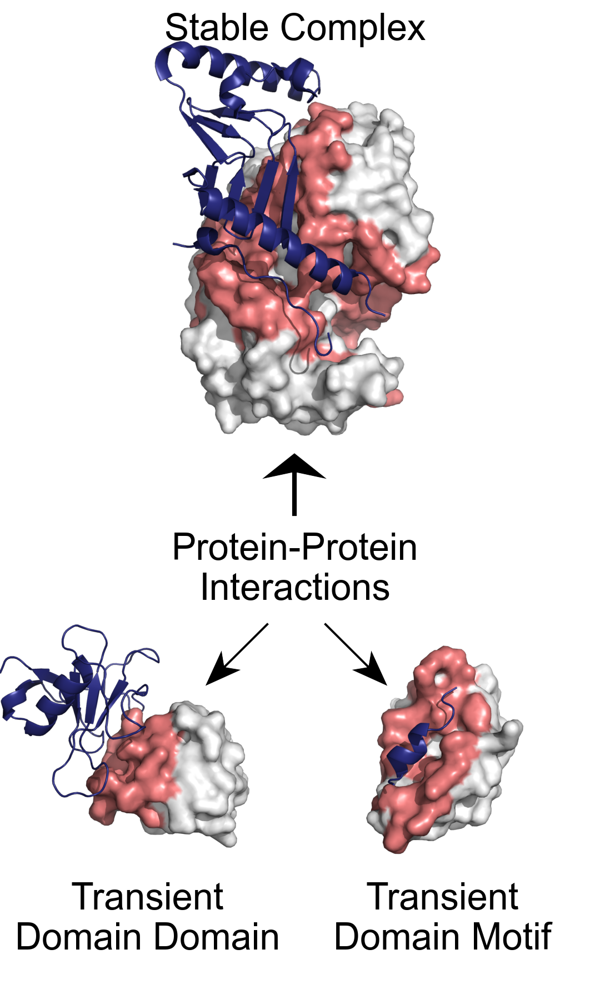
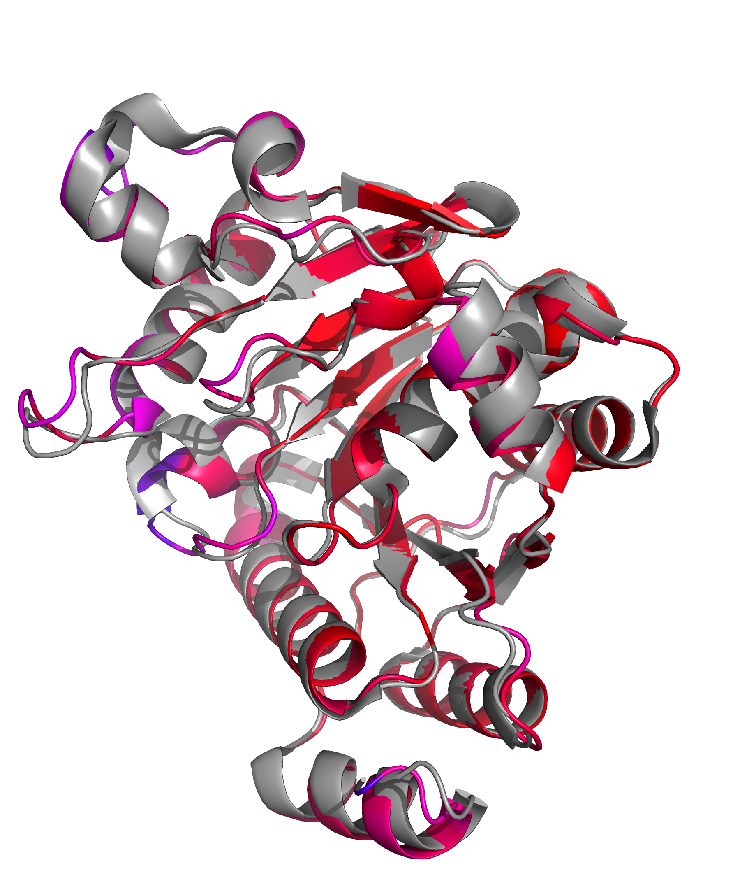

<p align="center">
    
</p>

# Rapid generation of high-quality structure figures for publication with PyMOL-PUB

With the rapid progress of fields like protein structure prediction, 
an increasing number of researchers from different backgrounds require the use of 
%5BPyMOL%5D(https://pymol.org/2/) for molecular visualization.
To be used in publications, the default visualization output of PyMOL typically requires 
the spatial adjustments, such as rotating and/or zooming the structures, and 
purposeful emphasis including highlighting important parts and hiding the unimportant parts.
Meanwhile, the need for batch visualization has been demonstrated by recent publications in high-impact journals.
However, these adjustments and batch protocols require the involvement of many skilled personnel, are expensive, 
and operate at human speeds, all of which make them worthy of automation.
Based on the original design of PyMOL and as an important supplement, 
we develop a high-level interface in order to generate figures capable of reaching the 
publication standard.
By using our tool, the manual operations can be greatly reduced, 
and the desired image output can be obtained with a few lines of code or by operations through GUI.

<p align="center">
    
</p>


## Citation
If you think this repo helps or being used in your research, please consider refer this 
%5Bpaper%5D(https://academic.oup.com/bioinformatics/article/40/3/btae139/7623589):

````
@article{chen2024rapid,
    author = {Chen, Yuting and Zhang, Haoling and Wang, Wen and Shen, Yue and Ping, Zhi},
    title = {Rapid generation of high-quality structure figures for publication with PyMOL-PUB},
    journal = {Bioinformatics},
    volume = {40},
    number = {3},
    pages = {btae139},
    year = {2024},
    month = {03},
    issn = {1367-4811},
    doi = {10.1093/bioinformatics/btae139},
    url = {https://doi.org/10.1093/bioinformatics/btae139},
}
````

## Case presentation
Based on three structures with default visualization output 

<table width="100%" align="center">
    <tr>
        <td bgcolor="#FFFFFF" align="center">1AY7</td>
        <td bgcolor="#FFFFFF" align="center">1F34</td>
        <td bgcolor="#FFFFFF" align="center">1YCR</td>
    </tr>
    <tr>
        <td bgcolor="#FFFFFF">
            
        </td>
        <td bgcolor="#FFFFFF">
            
        </td>
        <td bgcolor="#FFFFFF">
            
        </td>
    </tr>
</table>

an ideal publication-standard figure 

<p align="center">
    
</p>

can be %5Bcreated%5D(https://github.com/BGI-SynBio/PyMOL-PUB/blob/main/cases/case_1.py) 
using 55 lines of code, which is similar to Figure 1 of 
%5BCarles Corbi-Verge et al. work%5D(https://biosignaling.biomedcentral.com/articles/10.1186/s12964-016-0131-4).

Furthermore, we provide some high-level visualization usage 
for displaying physicochemical properties and alignment comparison results (e.g. RMSD) of target structure(s).
For example, the following left panel describes the difference 
between the expected structure and the predicted structure, 
reported in Figure 1 of %5BZeming Lin et al. work%5D(https://www.science.org/doi/abs/10.1126/science.ade2574).
Here, to avoid a cluttered information in the structure overlapping parts, 
we depict solely the predicted structure (center panel), and illustrate the difference 
between the predicted and anticipated structures by 
varying the thickness and gradient color of the cartoon representation (see the following right panel).


<table width="100%" align="center">
    <tr>
        <td bgcolor="#FFFFFF" align="center">expected</td>
        <td bgcolor="#FFFFFF" align="center">designed (equal)</td>
        <td bgcolor="#FFFFFF" align="center">designed (improve)</td>
    </tr>
    <tr>
        <td bgcolor="#FFFFFF">
            
        </td>
        <td bgcolor="#FFFFFF">
            
        </td>
        <td bgcolor="#FFFFFF">
            
        </td>
    </tr>
</table>

## Installation
You can install it using pip:

```sh
pip install PyMOL-PUB
```

Or you can install it from source after installing %5Bgit%5D(https://git-scm.com/):

```sh
git clone https://github.com/BGI-SynBio/PyMOL-PUB.git
cd PyMOL-PUB
pip install -r requirements.txt
python setup.py install develop --user
```

The tool requires 
%5BPython >= 3.7.3%5D(https://www.python.org/downloads/release/python-373/).
As the foundation of this tool, we require a PyMOL version equal to 2.5.0.
Please refer to the %5Bofficial website%5D(https://pymol.org/2/#download) for installation protocol details.
 
Additionally, some well-established libraries are required: 
%5Bbiopython >= 1.78%5D(https://pypi.org/project/biopython/1.78/), 
%5Bmatplotlib >= 3.2.0%5D(https://pypi.org/project/matplotlib/3.2.0/), 
%5Bnumpy >= 1.21.2%5D(https://pypi.org/project/numpy/1.21.2/), 
%5Bpillow >= 8.2.0%5D(https://pypi.org/project/Pillow/8.2.0/), 
%5Bscipy >= 1.4.1%5D(https://pypi.org/project/scipy/1.4.1/), 
%5Bsphinx-rtd-theme >= 0.4.3%5D(https://pypi.org/project/sphinx-rtd-theme/0.4.3/) and 
%5BPyQt5 >= 5.15.9%5D(https://pypi.org/project/PyQt5/5.15.9/) (a special dependency required by the GUI).
### Note on your PyMOL version
The PyMOL software includes a Linux-distribution version and an open-source version.
The two different versions have different installation dependencies.
You need to carefully read the respective installation instructions and choose the required version according to your own need.
For example, PyMOL distribution versions bundle specific Python environment versions to achieve richer functionality (like PyMOL 2.5.7 with Python 3.9).
Here we recommend you to choose the open-source version of PyMOL to directly experience the drawing functionality of PyMOL-PUB.

## Customizations and protocols
### Publication-standard figure creation
At the figure level, we can customize the target publication format during the 
%5Binitialization%5D(https://github.com/BGI-SynBio/PyMOL-PUB/blob/main/molpub/layouts.py#L493) of the figure.
The supporting figure formats of journal, conference or publisher are:

<table width="100%" align="center">
    <tr>
        <th bgcolor="#FFFFFF" align="center" rowspan="2">target</th>
        <th bgcolor="#FFFFFF" align="center" rowspan="2">font</th>
        <th bgcolor="#FFFFFF" align="center" rowspan="2">math font</th>
        <th bgcolor="#FFFFFF" align="center" rowspan="2">dots per inch (dpi)</th>
        <th bgcolor="#FFFFFF" align="center" rowspan="2">max columns</th>
        <th colspan="3">width under column occupy (inches)</th>
    </tr>
    <tr>
        <th bgcolor="#FFFFFF" align="center">1</th>
        <th bgcolor="#FFFFFF" align="center">2</th>
        <th bgcolor="#FFFFFF" align="center">3</th>
    </tr>
    <tr>
        <td bgcolor="#FFFFFF" align="center"><a href="https://www.nature.com/nature/for-authors/formatting-guide">Nature</a></td>
        <td bgcolor="#FFFFFF" align="center">Arial</td>
        <td bgcolor="#FFFFFF" align="center" rowspan="9">Linux Libertine<br/>&<br/>Lucida Calligraphy</td>
        <td bgcolor="#FFFFFF" align="center">300</td>
        <td bgcolor="#FFFFFF" align="center">2</td>
        <td bgcolor="#FFFFFF" align="center">3.54</td>
        <td bgcolor="#FFFFFF" align="center">7.08</td>
        <td bgcolor="#FFFFFF" align="center">-</td>
    </tr>
    <tr>
        <td bgcolor="#FFFFFF" align="center"><a href="https://www.science.org/content/page/instructions-preparing-initial-manuscript#preparation-of-figures">Science</a></td>
        <td bgcolor="#FFFFFF" align="center">Helvetica</td>
        <td bgcolor="#FFFFFF" align="center">300</td>
        <td bgcolor="#FFFFFF" align="center">3</td>
        <td bgcolor="#FFFFFF" align="center">2.24</td>
        <td bgcolor="#FFFFFF" align="center">4.76</td>
        <td bgcolor="#FFFFFF" align="center">7.24</td>
    </tr>
    <tr>
        <td bgcolor="#FFFFFF" align="center" rowspan="2"><a href="https://www.cell.com/figureguidelines">Cell</a></td>
        <td bgcolor="#FFFFFF" align="center" rowspan="2">Arial</td>
        <td bgcolor="#FFFFFF" align="center" rowspan="2">300</td>
        <td bgcolor="#FFFFFF" align="center">2</td>
        <td bgcolor="#FFFFFF" align="center">3.35</td>
        <td bgcolor="#FFFFFF" align="center">6.85</td>
        <td bgcolor="#FFFFFF" align="center">-</td>
    </tr>
    <tr>
        <td bgcolor="#FFFFFF" align="center">3</td>
        <td bgcolor="#FFFFFF" align="center">2.17</td>
        <td bgcolor="#FFFFFF" align="center">4.49</td>
        <td bgcolor="#FFFFFF" align="center">6.85</td>
    </tr>
    <tr>
        <td bgcolor="#FFFFFF" align="center"><a href="https://www.pnas.org/author-center/submitting-your-manuscript">PNAS</a></td>
        <td bgcolor="#FFFFFF" align="center">Helvetica</td>
        <td bgcolor="#FFFFFF" align="center">600</td>
        <td bgcolor="#FFFFFF" align="center">2</td>
        <td bgcolor="#FFFFFF" align="center">3.42</td>
        <td bgcolor="#FFFFFF" align="center">7.00</td>
        <td bgcolor="#FFFFFF" align="center">-</td>
    </tr>
    <tr>
        <td bgcolor="#FFFFFF" align="center"><a href="https://pubs.acs.org/page/4authors/submission/graphics_prep.html">ACS</a></td>
        <td bgcolor="#FFFFFF" align="center">Arial</td>
        <td bgcolor="#FFFFFF" align="center">600</td>
        <td bgcolor="#FFFFFF" align="center">2</td>
        <td bgcolor="#FFFFFF" align="center">3.25</td>
        <td bgcolor="#FFFFFF" align="center">7.00</td>
        <td bgcolor="#FFFFFF" align="center">-</td>
    </tr>
    <tr>
        <td bgcolor="#FFFFFF" align="center"><a href="https://academic.oup.com/bioinformatics/pages/instructions_for_authors">Oxford</a></td>
        <td bgcolor="#FFFFFF" align="center">Arial</td>
        <td bgcolor="#FFFFFF" align="center">350</td>
        <td bgcolor="#FFFFFF" align="center">2</td>
        <td bgcolor="#FFFFFF" align="center">3.39</td>
        <td bgcolor="#FFFFFF" align="center">7.00</td>
        <td bgcolor="#FFFFFF" align="center">-</td>
    </tr>
    <tr>
        <td bgcolor="#FFFFFF" align="center"><a href="https://journals.plos.org/ploscompbiol/s/figures">PLOS</a></td>
        <td bgcolor="#FFFFFF" align="center">Arial</td>
        <td bgcolor="#FFFFFF" align="center">300</td>
        <td bgcolor="#FFFFFF" align="center">1</td>
        <td bgcolor="#FFFFFF" align="center">5.20</td>
        <td bgcolor="#FFFFFF" align="center">-</td>
        <td bgcolor="#FFFFFF" align="center">-</td>
    </tr>
    <tr>
        <td bgcolor="#FFFFFF" align="center"><a href="https://www.ieee.org/content/dam/ieee-org/ieee/web/org/pubs/format-definition-table-and-glossary.pdf">IEEE</a></td>
        <td bgcolor="#FFFFFF" align="center">Times New Roman</td>
        <td bgcolor="#FFFFFF" align="center">300</td>
        <td bgcolor="#FFFFFF" align="center">2</td>
        <td bgcolor="#FFFFFF" align="center">3.50</td>
        <td bgcolor="#FFFFFF" align="center">7.25</td>
        <td bgcolor="#FFFFFF" align="center">-</td>
    </tr>
</table>

The collected font format are:
"Time New Roman", "Helvetica", "Arial", "Linux Libertine" and "Lucida Calligraphy".
The TTF files are located in the 
%5B'fonts'%5D(https://github.com/BGI-SynBio/PyMOL-PUB/tree/main/molpub/fonts) folder.
These font formats will automatically connect to matplotlib when PyMOL-PUB initializes.  

The target figure can be set to the Science format and full width by constructing the subsequent object.

```python
from molpub.layouts import Figure
figure = Figure(manuscript_format="Science", occupied_columns=3)
```

Once the figure has been created, 
it is possible to insert the generated structure image(s) into it 
by utilizing the %5B"set_image"%5D(https://github.com/BGI-SynBio/PyMOL-PUB/blob/main/molpub/layouts.py#L692) function 
or paint various outcomes, 
like %5Bline chart, bar chart, violin chart, and so on%5D(https://matplotlib.org/stable/gallery/index), 
through the %5B"set_panel"%5D(https://github.com/BGI-SynBio/PyMOL-PUB/blob/main/molpub/layouts.py#L663) function.
The %5BFigure%5D(https://github.com/BGI-SynBio/PyMOL-PUB/blob/main/molpub/layouts.py#L491) class 
also provides a 
%5Bgrid selection%5D(https://github.com/BGI-SynBio/PyMOL-PUB/blob/main/molpub/layouts.py#L644) function
since publications usually have varying information to display in one figure.

### Structure image creation
For the structure image, two types of rendering objectives have been offered: 
the first aims to accentuate specific region(s), 
and the second intends to showcase element (deoxyribonucleic acid, ribonucleic acid and amino acid) 
property information in the structure.
The %5BHighlightStructureImage%5D(https://github.com/BGI-SynBio/PyMOL-PUB/blob/main/molpub/layouts.py#L303) class 
can offer adequate services for the former, 
whereas the 
%5BPropertyStructureImage%5D(https://github.com/BGI-SynBio/PyMOL-PUB/blob/main/molpub/layouts.py#L418) class 
is developed for the latter.

Irrespective of the structure visualisation method, 
as applicable in all cases, 
the recommended function calling order (not mandatory) is to 
(1) omit unnecessary parts by 
%5B"set_cache"%5D(https://github.com/BGI-SynBio/PyMOL-PUB/blob/main/molpub/layouts.py#L29) function, 
(2) adjust the structure's spatial orientation by
%5B"set_state"%5D(https://github.com/BGI-SynBio/PyMOL-PUB/blob/main/molpub/layouts.py#L127) function, 
(3) modify the structure or its parts representation by
%5B"set_shape"%5D(https://github.com/BGI-SynBio/PyMOL-PUB/blob/main/molpub/layouts.py#L174) function, 
(4) complete coloring of the structure or its parts 
by highlight %5Bcoloring%5D(https://github.com/BGI-SynBio/PyMOL-PUB/blob/main/molpub/layouts.py#L305) 
or property driven %5Bcoloring%5D(https://github.com/BGI-SynBio/PyMOL-PUB/blob/main/molpub/layouts.py#L420),
both called "set_color" function in the corresponding class,
and (5) save the image by %5B"save"%5D(https://github.com/BGI-SynBio/PyMOL-PUB/blob/main/molpub/layouts.py#L283) function.

A highlight structure image example can be:
```python
from molpub.layouts import HighlightStructureImage

# create a structure image based on a structure file "structure.pdb".
image = HighlightStructureImage(structure_paths=%5B"structure.pdb"%5D)
# hide all water molecules.
image.set_cache(cache_contents=%5B"residue:HOH"%5D)
# set A-chain to surface representation and B-chain to cartoon representation.
image.set_shape(representation_plan=%5B("chain:A", "surface"), ("chain:B", "cartoon")%5D)
# rotate the structure according to the x-axis 240 degrees, y-axis 340 degrees, and z-axis 90 degrees.
image.set_state(rotate=%5B240, 340, 90%5D)
# set A-chain to "0xF2F2F2" color and B-chain to "0x2D2F82" color.
image.set_color(coloring_plan=%5B("chain:A", "0xF2F2F2"), ("chain:B", "0x2D2F82")%5D)
# save the structure with the width 1280 and the height 1280 * 0.8 = 1024.
image.save(save_path="structure.png", width=1280, ratio=0.8)
```

Besides, a property driven structure image example can be:

```python
from molpub.layouts import PropertyStructureImage

# create a structure image based on two structure files "expected.pdb" and "predicted.pdb".
image = PropertyStructureImage(structure_paths=%5B"expected.pdb", "predicted.pdb"%5D)
# set two structures to cartoon representation.
image.set_shape(representation_plan=%5B("model:predicted", "cartoon"), ("model:expected", "cartoon")%5D)
# rotate the structure according to the x-axis 0 degrees, y-axis 60 degrees, and z-axis 255 degrees.
# and align two structures based on the PyMOL built-in method using the expected structure as a template.
image.set_state(rotate=%5B0, 60, 255%5D, inner_align=True, target="expected")
# set the color of predicted structure is the rainbow spectrum, starting in red and ending in purple.
image.set_color(target="model:predicted", color_map="rainbow", edge_color="0x000000", gauge_strengthen=True)
# save the structure with the width 1800 and the height 1800 * 0.5 = 900.
image.save(save_path="aligned_structure.png", width=1800, ratio=0.5)
```

More comparable cases are attached in the %5Bcases%5D(./cases) folder.

### Scalable string expression for part selection
We present a string expression to describe two types of selection scheme, 
one is "all" and another is "type:target,target,...,target",
which avoids users from needing to input extensive selection information based on the original PyMOL design.

Here, "type" is selection class, including (1) "position", (2) "range", (3) "residue", (4) "segment", 
(5) "chain" and (6) "model".
"target" represents the selection range under the corresponding "type".

Some examples are shown below:
```python
# select the model called "predicted".
a = "model:predicted"
# select A-chain.
b = "chain:A"
# select segment "NPGP" in all chains.
c = "segment:NPGP"
# select residue "HOH" in all chains.
d = "residue:HOH"
# select range from 10 to 20 and from 50 to 60 in all chains.
e = "range:10-20,50-60"
# select 10-th position in all chains.
f = "position:10"
```
For types below the chain scale, i.e. type (1) - (4), 
we provide a built-in chain description mechanism for more accurate selection.
For example:

```python
# select range from 10 to 20 in all chains.
a = "range:10-20"
# select range from 10 to 20 in A-chain.
b = "range:A+10-200"
```

### Rotation widget icons
Rotation widget icons describe the rotation of molecular structure, determined by the azimuth angle (for x+y plane) and the elevation angle (for z plane).

There are two styles.
In style 1, the widget is defined by direction and the azimuth angle.
<table align="center">
    <tr>
        <th rowspan="2">direction</th><th colspan="5">azimuth angle</th>
    </tr>
    <tr>
        <td bgcolor="#FFFFFF" align="center">30</td>
        <td bgcolor="#FFFFFF" align="center">60</td>
        <td bgcolor="#FFFFFF" align="center">90</td>
        <td bgcolor="#FFFFFF" align="center">120</td>
        <td bgcolor="#FFFFFF" align="center">180</td>
    </tr>
    <tr>
        <td bgcolor="#FFFFFF" align="center">+</td>
        <td bgcolor="#FFFFFF"></td>
        <td bgcolor="#FFFFFF"></td>
        <td bgcolor="#FFFFFF"></td>
        <td bgcolor="#FFFFFF"></td>
        <td bgcolor="#FFFFFF"></td>
    </tr>
    <tr>
        <td bgcolor="#FFFFFF" align="center">-</td>
        <td bgcolor="#FFFFFF"></td>
        <td bgcolor="#FFFFFF"></td>
        <td bgcolor="#FFFFFF"></td>
        <td bgcolor="#FFFFFF"></td>
        <td bgcolor="#FFFFFF"></td>
    </tr>
</table>

To generate such icon, you can use:
```python
from molpub.layouts import obtain_widget_icon

# rotate turn "right" and degree 30. 
obtain_widget_icon(save_path="temp path", widget_type="rotation", params={"turn": "right", "degree": 30}, dpi=1200)
```

and you can obtain

<p align="center">
    <image width="40%" src="https://github.com/BGI-SynBio/PyMOL-PUB/tree/main/docs/source/_static/widgets/rotation%5B-.1pi6%5D.svg"></image>
</p>

Here, the scope of "turn" is {"+", "-"} and that of "degree" is (0, 180\%5D.


Sometimes, we need to operate the elevation angle concurrently.
A more complex widget attribute setup is (elevation angle, azimuth angle).

<table align="center">
    <tr>
        <th rowspan="2">elevation angle</th><th colspan="11">azimuth angle</th>
    </tr>
    <tr>
        <td bgcolor="#FFFFFF" align="center">-180</td>
        <td bgcolor="#FFFFFF" align="center">-120</td>
        <td bgcolor="#FFFFFF" align="center">-90</td>
        <td bgcolor="#FFFFFF" align="center">-60</td>
        <td bgcolor="#FFFFFF" align="center">-30</td>
        <td bgcolor="#FFFFFF" align="center">0</td>
        <td bgcolor="#FFFFFF" align="center">+30</td>
        <td bgcolor="#FFFFFF" align="center">+60</td>
        <td bgcolor="#FFFFFF" align="center">+90</td>
        <td bgcolor="#FFFFFF" align="center">+120</td>
        <td bgcolor="#FFFFFF" align="center">+180</td>
    </tr>
    <tr>
        <td bgcolor="#FFFFFF" align="center">-180</td>
        <td bgcolor="#FFFFFF"><image src="https://github.com/BGI-SynBio/PyMOL-PUB/tree/main/docs/source/_static/widgets/rotation%5B-1pi1.-1pi1%5D.svg"></image></td>
        <td bgcolor="#FFFFFF"><image src="https://github.com/BGI-SynBio/PyMOL-PUB/tree/main/docs/source/_static/widgets/rotation%5B-1pi1.-2pi3%5D.svg"></image></td>
        <td bgcolor="#FFFFFF"><image src="https://github.com/BGI-SynBio/PyMOL-PUB/tree/main/docs/source/_static/widgets/rotation%5B-1pi1.-1pi2%5D.svg"></image></td>
        <td bgcolor="#FFFFFF"><image src="https://github.com/BGI-SynBio/PyMOL-PUB/tree/main/docs/source/_static/widgets/rotation%5B-1pi1.-1pi3%5D.svg"></image></td>
        <td bgcolor="#FFFFFF"><image src="https://github.com/BGI-SynBio/PyMOL-PUB/tree/main/docs/source/_static/widgets/rotation%5B-1pi1.-1pi6%5D.svg"></image></td>
        <td bgcolor="#FFFFFF"><image src="https://github.com/BGI-SynBio/PyMOL-PUB/tree/main/docs/source/_static/widgets/rotation%5B-1pi1.%2B0pi1%5D.svg"></image></td>
        <td bgcolor="#FFFFFF"><image src="https://github.com/BGI-SynBio/PyMOL-PUB/tree/main/docs/source/_static/widgets/rotation%5B-1pi1.%2B1pi6%5D.svg"></image></td>
        <td bgcolor="#FFFFFF"><image src="https://github.com/BGI-SynBio/PyMOL-PUB/tree/main/docs/source/_static/widgets/rotation%5B-1pi1.%2B1pi3%5D.svg"></image></td>
        <td bgcolor="#FFFFFF"><image src="https://github.com/BGI-SynBio/PyMOL-PUB/tree/main/docs/source/_static/widgets/rotation%5B-1pi1.%2B1pi2%5D.svg"></image></td>
        <td bgcolor="#FFFFFF"><image src="https://github.com/BGI-SynBio/PyMOL-PUB/tree/main/docs/source/_static/widgets/rotation%5B-1pi1.%2B2pi3%5D.svg"></image></td>
        <td bgcolor="#FFFFFF"><image src="https://github.com/BGI-SynBio/PyMOL-PUB/tree/main/docs/source/_static/widgets/rotation%5B-1pi1.%2B1pi1%5D.svg"></image></td>
    </tr>
    <tr>
        <td bgcolor="#FFFFFF" align="center">-120</td>
        <td bgcolor="#FFFFFF"><image src="https://github.com/BGI-SynBio/PyMOL-PUB/tree/main/docs/source/_static/widgets/rotation%5B-2pi3.-1pi1%5D.svg"></image></td>
        <td bgcolor="#FFFFFF"><image src="https://github.com/BGI-SynBio/PyMOL-PUB/tree/main/docs/source/_static/widgets/rotation%5B-2pi3.-2pi3%5D.svg"></image></td>
        <td bgcolor="#FFFFFF"><image src="https://github.com/BGI-SynBio/PyMOL-PUB/tree/main/docs/source/_static/widgets/rotation%5B-2pi3.-1pi2%5D.svg"></image></td>
        <td bgcolor="#FFFFFF"><image src="https://github.com/BGI-SynBio/PyMOL-PUB/tree/main/docs/source/_static/widgets/rotation%5B-2pi3.-1pi3%5D.svg"></image></td>
        <td bgcolor="#FFFFFF"><image src="https://github.com/BGI-SynBio/PyMOL-PUB/tree/main/docs/source/_static/widgets/rotation%5B-2pi3.-1pi6%5D.svg"></image></td>
        <td bgcolor="#FFFFFF"><image src="https://github.com/BGI-SynBio/PyMOL-PUB/tree/main/docs/source/_static/widgets/rotation%5B-2pi3.%2B0pi1%5D.svg"></image></td>
        <td bgcolor="#FFFFFF"><image src="https://github.com/BGI-SynBio/PyMOL-PUB/tree/main/docs/source/_static/widgets/rotation%5B-2pi3.%2B1pi6%5D.svg"></image></td>
        <td bgcolor="#FFFFFF"><image src="https://github.com/BGI-SynBio/PyMOL-PUB/tree/main/docs/source/_static/widgets/rotation%5B-2pi3.%2B1pi3%5D.svg"></image></td>
        <td bgcolor="#FFFFFF"><image src="https://github.com/BGI-SynBio/PyMOL-PUB/tree/main/docs/source/_static/widgets/rotation%5B-2pi3.%2B1pi2%5D.svg"></image></td>
        <td bgcolor="#FFFFFF"><image src="https://github.com/BGI-SynBio/PyMOL-PUB/tree/main/docs/source/_static/widgets/rotation%5B-2pi3.%2B2pi3%5D.svg"></image></td>
        <td bgcolor="#FFFFFF"><image src="https://github.com/BGI-SynBio/PyMOL-PUB/tree/main/docs/source/_static/widgets/rotation%5B-2pi3.%2B1pi1%5D.svg"></image></td>
    </tr>
    <tr>
        <td bgcolor="#FFFFFF" align="center">-90</td>
        <td bgcolor="#FFFFFF"><image src="https://github.com/BGI-SynBio/PyMOL-PUB/tree/main/docs/source/_static/widgets/rotation%5B-1pi2.-1pi1%5D.svg"></image></td>
        <td bgcolor="#FFFFFF"><image src="https://github.com/BGI-SynBio/PyMOL-PUB/tree/main/docs/source/_static/widgets/rotation%5B-1pi2.-2pi3%5D.svg"></image></td>
        <td bgcolor="#FFFFFF"><image src="https://github.com/BGI-SynBio/PyMOL-PUB/tree/main/docs/source/_static/widgets/rotation%5B-1pi2.-1pi2%5D.svg"></image></td>
        <td bgcolor="#FFFFFF"><image src="https://github.com/BGI-SynBio/PyMOL-PUB/tree/main/docs/source/_static/widgets/rotation%5B-1pi2.-1pi3%5D.svg"></image></td>
        <td bgcolor="#FFFFFF"><image src="https://github.com/BGI-SynBio/PyMOL-PUB/tree/main/docs/source/_static/widgets/rotation%5B-1pi2.-1pi6%5D.svg"></image></td>
        <td bgcolor="#FFFFFF"><image src="https://github.com/BGI-SynBio/PyMOL-PUB/tree/main/docs/source/_static/widgets/rotation%5B-1pi2.%2B0pi1%5D.svg"></image></td>
        <td bgcolor="#FFFFFF"><image src="https://github.com/BGI-SynBio/PyMOL-PUB/tree/main/docs/source/_static/widgets/rotation%5B-1pi2.%2B1pi6%5D.svg"></image></td>
        <td bgcolor="#FFFFFF"><image src="https://github.com/BGI-SynBio/PyMOL-PUB/tree/main/docs/source/_static/widgets/rotation%5B-1pi2.%2B1pi3%5D.svg"></image></td>
        <td bgcolor="#FFFFFF"><image src="https://github.com/BGI-SynBio/PyMOL-PUB/tree/main/docs/source/_static/widgets/rotation%5B-1pi2.%2B1pi2%5D.svg"></image></td>
        <td bgcolor="#FFFFFF"><image src="https://github.com/BGI-SynBio/PyMOL-PUB/tree/main/docs/source/_static/widgets/rotation%5B-1pi2.%2B2pi3%5D.svg"></image></td>
        <td bgcolor="#FFFFFF"><image src="https://github.com/BGI-SynBio/PyMOL-PUB/tree/main/docs/source/_static/widgets/rotation%5B-1pi2.%2B1pi1%5D.svg"></image></td>
    </tr>
    <tr>
        <td bgcolor="#FFFFFF" align="center">-60</td>
        <td bgcolor="#FFFFFF"><image src="https://github.com/BGI-SynBio/PyMOL-PUB/tree/main/docs/source/_static/widgets/rotation%5B-1pi3.-1pi1%5D.svg"></image></td>
        <td bgcolor="#FFFFFF"><image src="https://github.com/BGI-SynBio/PyMOL-PUB/tree/main/docs/source/_static/widgets/rotation%5B-1pi3.-2pi3%5D.svg"></image></td>
        <td bgcolor="#FFFFFF"><image src="https://github.com/BGI-SynBio/PyMOL-PUB/tree/main/docs/source/_static/widgets/rotation%5B-1pi3.-1pi2%5D.svg"></image></td>
        <td bgcolor="#FFFFFF"><image src="https://github.com/BGI-SynBio/PyMOL-PUB/tree/main/docs/source/_static/widgets/rotation%5B-1pi3.-1pi3%5D.svg"></image></td>
        <td bgcolor="#FFFFFF"><image src="https://github.com/BGI-SynBio/PyMOL-PUB/tree/main/docs/source/_static/widgets/rotation%5B-1pi3.-1pi6%5D.svg"></image></td>
        <td bgcolor="#FFFFFF"><image src="https://github.com/BGI-SynBio/PyMOL-PUB/tree/main/docs/source/_static/widgets/rotation%5B-1pi3.%2B0pi1%5D.svg"></image></td>
        <td bgcolor="#FFFFFF"><image src="https://github.com/BGI-SynBio/PyMOL-PUB/tree/main/docs/source/_static/widgets/rotation%5B-1pi3.%2B1pi6%5D.svg"></image></td>
        <td bgcolor="#FFFFFF"><image src="https://github.com/BGI-SynBio/PyMOL-PUB/tree/main/docs/source/_static/widgets/rotation%5B-1pi3.%2B1pi3%5D.svg"></image></td>
        <td bgcolor="#FFFFFF"><image src="https://github.com/BGI-SynBio/PyMOL-PUB/tree/main/docs/source/_static/widgets/rotation%5B-1pi3.%2B1pi2%5D.svg"></image></td>
        <td bgcolor="#FFFFFF"><image src="https://github.com/BGI-SynBio/PyMOL-PUB/tree/main/docs/source/_static/widgets/rotation%5B-1pi3.%2B2pi3%5D.svg"></image></td>
        <td bgcolor="#FFFFFF"><image src="https://github.com/BGI-SynBio/PyMOL-PUB/tree/main/docs/source/_static/widgets/rotation%5B-1pi3.%2B1pi1%5D.svg"></image></td>
    </tr>
    <tr>
        <td bgcolor="#FFFFFF" align="center">-30</td>
        <td bgcolor="#FFFFFF"><image src="https://github.com/BGI-SynBio/PyMOL-PUB/tree/main/docs/source/_static/widgets/rotation%5B-1pi6.-1pi1%5D.svg"></image></td>
        <td bgcolor="#FFFFFF"><image src="https://github.com/BGI-SynBio/PyMOL-PUB/tree/main/docs/source/_static/widgets/rotation%5B-1pi6.-2pi3%5D.svg"></image></td>
        <td bgcolor="#FFFFFF"><image src="https://github.com/BGI-SynBio/PyMOL-PUB/tree/main/docs/source/_static/widgets/rotation%5B-1pi6.-1pi2%5D.svg"></image></td>
        <td bgcolor="#FFFFFF"><image src="https://github.com/BGI-SynBio/PyMOL-PUB/tree/main/docs/source/_static/widgets/rotation%5B-1pi6.-1pi3%5D.svg"></image></td>
        <td bgcolor="#FFFFFF"><image src="https://github.com/BGI-SynBio/PyMOL-PUB/tree/main/docs/source/_static/widgets/rotation%5B-1pi6.-1pi6%5D.svg"></image></td>
        <td bgcolor="#FFFFFF"><image src="https://github.com/BGI-SynBio/PyMOL-PUB/tree/main/docs/source/_static/widgets/rotation%5B-1pi6.%2B0pi1%5D.svg"></image></td>
        <td bgcolor="#FFFFFF"><image src="https://github.com/BGI-SynBio/PyMOL-PUB/tree/main/docs/source/_static/widgets/rotation%5B-1pi6.%2B1pi6%5D.svg"></image></td>
        <td bgcolor="#FFFFFF"><image src="https://github.com/BGI-SynBio/PyMOL-PUB/tree/main/docs/source/_static/widgets/rotation%5B-1pi6.%2B1pi3%5D.svg"></image></td>
        <td bgcolor="#FFFFFF"><image src="https://github.com/BGI-SynBio/PyMOL-PUB/tree/main/docs/source/_static/widgets/rotation%5B-1pi6.%2B1pi2%5D.svg"></image></td>
        <td bgcolor="#FFFFFF"><image src="https://github.com/BGI-SynBio/PyMOL-PUB/tree/main/docs/source/_static/widgets/rotation%5B-1pi6.%2B2pi3%5D.svg"></image></td>
        <td bgcolor="#FFFFFF"><image src="https://github.com/BGI-SynBio/PyMOL-PUB/tree/main/docs/source/_static/widgets/rotation%5B-1pi6.%2B1pi1%5D.svg"></image></td>
    </tr>
    <tr>
        <td bgcolor="#FFFFFF" align="center">0</td>
        <td bgcolor="#FFFFFF"><image src="https://github.com/BGI-SynBio/PyMOL-PUB/tree/main/docs/source/_static/widgets/rotation%5B+0pi1.-1pi1%5D.svg"></image></td>
        <td bgcolor="#FFFFFF"><image src="https://github.com/BGI-SynBio/PyMOL-PUB/tree/main/docs/source/_static/widgets/rotation%5B+0pi1.-2pi3%5D.svg"></image></td>
        <td bgcolor="#FFFFFF"><image src="https://github.com/BGI-SynBio/PyMOL-PUB/tree/main/docs/source/_static/widgets/rotation%5B+0pi1.-1pi2%5D.svg"></image></td>
        <td bgcolor="#FFFFFF"><image src="https://github.com/BGI-SynBio/PyMOL-PUB/tree/main/docs/source/_static/widgets/rotation%5B+0pi1.-1pi3%5D.svg"></image></td>
        <td bgcolor="#FFFFFF"><image src="https://github.com/BGI-SynBio/PyMOL-PUB/tree/main/docs/source/_static/widgets/rotation%5B+0pi1.-1pi6%5D.svg"></image></td>
        <td bgcolor="#FFFFFF" align="center">N/A</td>
        <td bgcolor="#FFFFFF"><image src="https://github.com/BGI-SynBio/PyMOL-PUB/tree/main/docs/source/_static/widgets/rotation%5B+0pi1.%2B1pi6%5D.svg"></image></td>
        <td bgcolor="#FFFFFF"><image src="https://github.com/BGI-SynBio/PyMOL-PUB/tree/main/docs/source/_static/widgets/rotation%5B+0pi1.%2B1pi3%5D.svg"></image></td>
        <td bgcolor="#FFFFFF"><image src="https://github.com/BGI-SynBio/PyMOL-PUB/tree/main/docs/source/_static/widgets/rotation%5B+0pi1.%2B1pi2%5D.svg"></image></td>
        <td bgcolor="#FFFFFF"><image src="https://github.com/BGI-SynBio/PyMOL-PUB/tree/main/docs/source/_static/widgets/rotation%5B+0pi1.%2B2pi3%5D.svg"></image></td>
        <td bgcolor="#FFFFFF"><image src="https://github.com/BGI-SynBio/PyMOL-PUB/tree/main/docs/source/_static/widgets/rotation%5B+0pi1.%2B1pi1%5D.svg"></image></td>
    </tr>
    <tr>
        <td bgcolor="#FFFFFF" align="center">+30</td>
        <td bgcolor="#FFFFFF"><image src="https://github.com/BGI-SynBio/PyMOL-PUB/tree/main/docs/source/_static/widgets/rotation%5B+1pi6.-1pi1%5D.svg"></image></td>
        <td bgcolor="#FFFFFF"><image src="https://github.com/BGI-SynBio/PyMOL-PUB/tree/main/docs/source/_static/widgets/rotation%5B+1pi6.-2pi3%5D.svg"></image></td>
        <td bgcolor="#FFFFFF"><image src="https://github.com/BGI-SynBio/PyMOL-PUB/tree/main/docs/source/_static/widgets/rotation%5B+1pi6.-1pi2%5D.svg"></image></td>
        <td bgcolor="#FFFFFF"><image src="https://github.com/BGI-SynBio/PyMOL-PUB/tree/main/docs/source/_static/widgets/rotation%5B+1pi6.-1pi3%5D.svg"></image></td>
        <td bgcolor="#FFFFFF"><image src="https://github.com/BGI-SynBio/PyMOL-PUB/tree/main/docs/source/_static/widgets/rotation%5B+1pi6.-1pi6%5D.svg"></image></td>
        <td bgcolor="#FFFFFF"><image src="https://github.com/BGI-SynBio/PyMOL-PUB/tree/main/docs/source/_static/widgets/rotation%5B+1pi6.%2B0pi1%5D.svg"></image></td>
        <td bgcolor="#FFFFFF"><image src="https://github.com/BGI-SynBio/PyMOL-PUB/tree/main/docs/source/_static/widgets/rotation%5B+1pi6.%2B1pi6%5D.svg"></image></td>
        <td bgcolor="#FFFFFF"><image src="https://github.com/BGI-SynBio/PyMOL-PUB/tree/main/docs/source/_static/widgets/rotation%5B+1pi6.%2B1pi3%5D.svg"></image></td>
        <td bgcolor="#FFFFFF"><image src="https://github.com/BGI-SynBio/PyMOL-PUB/tree/main/docs/source/_static/widgets/rotation%5B+1pi6.%2B1pi2%5D.svg"></image></td>
        <td bgcolor="#FFFFFF"><image src="https://github.com/BGI-SynBio/PyMOL-PUB/tree/main/docs/source/_static/widgets/rotation%5B+1pi6.%2B2pi3%5D.svg"></image></td>
        <td bgcolor="#FFFFFF"><image src="https://github.com/BGI-SynBio/PyMOL-PUB/tree/main/docs/source/_static/widgets/rotation%5B+1pi6.%2B1pi1%5D.svg"></image></td>
    </tr>
    <tr>
        <td bgcolor="#FFFFFF" align="center">+60</td>
        <td bgcolor="#FFFFFF"><image src="https://github.com/BGI-SynBio/PyMOL-PUB/tree/main/docs/source/_static/widgets/rotation%5B+1pi3.-1pi1%5D.svg"></image></td>
        <td bgcolor="#FFFFFF"><image src="https://github.com/BGI-SynBio/PyMOL-PUB/tree/main/docs/source/_static/widgets/rotation%5B+1pi3.-2pi3%5D.svg"></image></td>
        <td bgcolor="#FFFFFF"><image src="https://github.com/BGI-SynBio/PyMOL-PUB/tree/main/docs/source/_static/widgets/rotation%5B+1pi3.-1pi2%5D.svg"></image></td>
        <td bgcolor="#FFFFFF"><image src="https://github.com/BGI-SynBio/PyMOL-PUB/tree/main/docs/source/_static/widgets/rotation%5B+1pi3.-1pi3%5D.svg"></image></td>
        <td bgcolor="#FFFFFF"><image src="https://github.com/BGI-SynBio/PyMOL-PUB/tree/main/docs/source/_static/widgets/rotation%5B+1pi3.-1pi6%5D.svg"></image></td>
        <td bgcolor="#FFFFFF"><image src="https://github.com/BGI-SynBio/PyMOL-PUB/tree/main/docs/source/_static/widgets/rotation%5B+1pi3.%2B0pi1%5D.svg"></image></td>
        <td bgcolor="#FFFFFF"><image src="https://github.com/BGI-SynBio/PyMOL-PUB/tree/main/docs/source/_static/widgets/rotation%5B+1pi3.%2B1pi6%5D.svg"></image></td>
        <td bgcolor="#FFFFFF"><image src="https://github.com/BGI-SynBio/PyMOL-PUB/tree/main/docs/source/_static/widgets/rotation%5B+1pi3.%2B1pi3%5D.svg"></image></td>
        <td bgcolor="#FFFFFF"><image src="https://github.com/BGI-SynBio/PyMOL-PUB/tree/main/docs/source/_static/widgets/rotation%5B+1pi3.%2B1pi2%5D.svg"></image></td>
        <td bgcolor="#FFFFFF"><image src="https://github.com/BGI-SynBio/PyMOL-PUB/tree/main/docs/source/_static/widgets/rotation%5B+1pi3.%2B2pi3%5D.svg"></image></td>
        <td bgcolor="#FFFFFF"><image src="https://github.com/BGI-SynBio/PyMOL-PUB/tree/main/docs/source/_static/widgets/rotation%5B+1pi3.%2B1pi1%5D.svg"></image></td>
    </tr>
    <tr>
        <td bgcolor="#FFFFFF" align="center">+90</td>
        <td bgcolor="#FFFFFF"><image src="https://github.com/BGI-SynBio/PyMOL-PUB/tree/main/docs/source/_static/widgets/rotation%5B+1pi2.-1pi1%5D.svg"></image></td>
        <td bgcolor="#FFFFFF"><image src="https://github.com/BGI-SynBio/PyMOL-PUB/tree/main/docs/source/_static/widgets/rotation%5B+1pi2.-2pi3%5D.svg"></image></td>
        <td bgcolor="#FFFFFF"><image src="https://github.com/BGI-SynBio/PyMOL-PUB/tree/main/docs/source/_static/widgets/rotation%5B+1pi2.-1pi2%5D.svg"></image></td>
        <td bgcolor="#FFFFFF"><image src="https://github.com/BGI-SynBio/PyMOL-PUB/tree/main/docs/source/_static/widgets/rotation%5B+1pi2.-1pi3%5D.svg"></image></td>
        <td bgcolor="#FFFFFF"><image src="https://github.com/BGI-SynBio/PyMOL-PUB/tree/main/docs/source/_static/widgets/rotation%5B+1pi2.-1pi6%5D.svg"></image></td>
        <td bgcolor="#FFFFFF"><image src="https://github.com/BGI-SynBio/PyMOL-PUB/tree/main/docs/source/_static/widgets/rotation%5B+1pi2.%2B0pi1%5D.svg"></image></td>
        <td bgcolor="#FFFFFF"><image src="https://github.com/BGI-SynBio/PyMOL-PUB/tree/main/docs/source/_static/widgets/rotation%5B+1pi2.%2B1pi6%5D.svg"></image></td>
        <td bgcolor="#FFFFFF"><image src="https://github.com/BGI-SynBio/PyMOL-PUB/tree/main/docs/source/_static/widgets/rotation%5B+1pi2.%2B1pi3%5D.svg"></image></td>
        <td bgcolor="#FFFFFF"><image src="https://github.com/BGI-SynBio/PyMOL-PUB/tree/main/docs/source/_static/widgets/rotation%5B+1pi2.%2B1pi2%5D.svg"></image></td>
        <td bgcolor="#FFFFFF"><image src="https://github.com/BGI-SynBio/PyMOL-PUB/tree/main/docs/source/_static/widgets/rotation%5B+1pi2.%2B2pi3%5D.svg"></image></td>
        <td bgcolor="#FFFFFF"><image src="https://github.com/BGI-SynBio/PyMOL-PUB/tree/main/docs/source/_static/widgets/rotation%5B+1pi2.%2B1pi1%5D.svg"></image></td>
    </tr>
    <tr>
        <td bgcolor="#FFFFFF" align="center">+120</td>
        <td bgcolor="#FFFFFF"><image src="https://github.com/BGI-SynBio/PyMOL-PUB/tree/main/docs/source/_static/widgets/rotation%5B+2pi3.-1pi1%5D.svg"></image></td>
        <td bgcolor="#FFFFFF"><image src="https://github.com/BGI-SynBio/PyMOL-PUB/tree/main/docs/source/_static/widgets/rotation%5B+2pi3.-2pi3%5D.svg"></image></td>
        <td bgcolor="#FFFFFF"><image src="https://github.com/BGI-SynBio/PyMOL-PUB/tree/main/docs/source/_static/widgets/rotation%5B+2pi3.-1pi2%5D.svg"></image></td>
        <td bgcolor="#FFFFFF"><image src="https://github.com/BGI-SynBio/PyMOL-PUB/tree/main/docs/source/_static/widgets/rotation%5B+2pi3.-1pi3%5D.svg"></image></td>
        <td bgcolor="#FFFFFF"><image src="https://github.com/BGI-SynBio/PyMOL-PUB/tree/main/docs/source/_static/widgets/rotation%5B+2pi3.-1pi6%5D.svg"></image></td>
        <td bgcolor="#FFFFFF"><image src="https://github.com/BGI-SynBio/PyMOL-PUB/tree/main/docs/source/_static/widgets/rotation%5B+2pi3.%2B0pi1%5D.svg"></image></td>
        <td bgcolor="#FFFFFF"><image src="https://github.com/BGI-SynBio/PyMOL-PUB/tree/main/docs/source/_static/widgets/rotation%5B+2pi3.%2B1pi6%5D.svg"></image></td>
        <td bgcolor="#FFFFFF"><image src="https://github.com/BGI-SynBio/PyMOL-PUB/tree/main/docs/source/_static/widgets/rotation%5B+2pi3.%2B1pi3%5D.svg"></image></td>
        <td bgcolor="#FFFFFF"><image src="https://github.com/BGI-SynBio/PyMOL-PUB/tree/main/docs/source/_static/widgets/rotation%5B+2pi3.%2B1pi2%5D.svg"></image></td>
        <td bgcolor="#FFFFFF"><image src="https://github.com/BGI-SynBio/PyMOL-PUB/tree/main/docs/source/_static/widgets/rotation%5B+2pi3.%2B2pi3%5D.svg"></image></td>
        <td bgcolor="#FFFFFF"><image src="https://github.com/BGI-SynBio/PyMOL-PUB/tree/main/docs/source/_static/widgets/rotation%5B+2pi3.%2B1pi1%5D.svg"></image></td>
    </tr>
    <tr>
        <td bgcolor="#FFFFFF" align="center">+180</td>
        <td bgcolor="#FFFFFF"><image src="https://github.com/BGI-SynBio/PyMOL-PUB/tree/main/docs/source/_static/widgets/rotation%5B+1pi1.-1pi1%5D.svg"></image></td>
        <td bgcolor="#FFFFFF"><image src="https://github.com/BGI-SynBio/PyMOL-PUB/tree/main/docs/source/_static/widgets/rotation%5B+1pi1.-2pi3%5D.svg"></image></td>
        <td bgcolor="#FFFFFF"><image src="https://github.com/BGI-SynBio/PyMOL-PUB/tree/main/docs/source/_static/widgets/rotation%5B+1pi1.-1pi2%5D.svg"></image></td>
        <td bgcolor="#FFFFFF"><image src="https://github.com/BGI-SynBio/PyMOL-PUB/tree/main/docs/source/_static/widgets/rotation%5B+1pi1.-1pi3%5D.svg"></image></td>
        <td bgcolor="#FFFFFF"><image src="https://github.com/BGI-SynBio/PyMOL-PUB/tree/main/docs/source/_static/widgets/rotation%5B+1pi1.-1pi6%5D.svg"></image></td>
        <td bgcolor="#FFFFFF"><image src="https://github.com/BGI-SynBio/PyMOL-PUB/tree/main/docs/source/_static/widgets/rotation%5B+1pi1.%2B0pi1%5D.svg"></image></td>
        <td bgcolor="#FFFFFF"><image src="https://github.com/BGI-SynBio/PyMOL-PUB/tree/main/docs/source/_static/widgets/rotation%5B+1pi1.%2B1pi6%5D.svg"></image></td>
        <td bgcolor="#FFFFFF"><image src="https://github.com/BGI-SynBio/PyMOL-PUB/tree/main/docs/source/_static/widgets/rotation%5B+1pi1.%2B1pi3%5D.svg"></image></td>
        <td bgcolor="#FFFFFF"><image src="https://github.com/BGI-SynBio/PyMOL-PUB/tree/main/docs/source/_static/widgets/rotation%5B+1pi1.%2B1pi2%5D.svg"></image></td>
        <td bgcolor="#FFFFFF"><image src="https://github.com/BGI-SynBio/PyMOL-PUB/tree/main/docs/source/_static/widgets/rotation%5B+1pi1.%2B2pi3%5D.svg"></image></td>
        <td bgcolor="#FFFFFF"><image src="https://github.com/BGI-SynBio/PyMOL-PUB/tree/main/docs/source/_static/widgets/rotation%5B+1pi1.%2B1pi1%5D.svg"></image></td>
    </tr>
</table>

The interface is shown in 
%5Bobtain_widget_icon%5D(https://github.com/BGI-SynBio/PyMOL-PUB/blob/main/molpub/layouts.py#L20).

To generate such icon, you can use:
```python
from molpub.layouts import obtain_widget_icon

# rotate elevation 30 and azimuth 30. 
obtain_widget_icon(save_path="temp path", widget_type="rotation", params={"elevation": 30, "azimuth": 30}, dpi=1200)
```

and you can obtain

<p align="center">
    <image width="40%" src="https://github.com/BGI-SynBio/PyMOL-PUB/tree/main/docs/source/_static/widgets/rotation%5B+1pi6.%2B1pi6%5D.svg"></image>
</p>

Here, the scope of "elevation" and "azimuth" and \%5B-180, 180\%5D.

## Usage of PyMOL-PUB surface (GUI)
Based on PyQt5, PyMOL-PUB offers a process-based plotting GUI to replace the cost of programming Python scripts.
It enables a broader spectrum of users, notably those without Python programming experience.
By running the %5Bwindows.py%5D(https://github.com/BGI-SynBio/PyMOL-PUB/blob/main/molpub/windows.py), you can start your drawing jobs using the PyMOL-PUB's GUI.
We provide a demo video that shows how to use the GUI to create the target figure, which can be found on %5BYouTube%5D(https://www.youtube.com/watch?v=4kbtMWG98h4).
You can follow along with the video to learn the operation of the GUI, 
or refer to the text instructions provided in the 
%5BPyMOL-PUB technical manual%5D(https://academic.oup.com/bioinformatics/article-lookup/doi/10.1093/bioinformatics/btae139#supplementary-data).

Sometimes, you might encounter an %5Bissue%5D(https://github.com/BGI-SynBio/PyMOL-PUB/issues/3) where GUI fails to launch. 
It typically arises if the 'molpub' directory, which contains 'windows.py', is not included in the working directory.
There are two simple solutions to resolve this issue:

- Find the windows.py file in your system, copy it to another folder, and run the copied script through a command prompt.
- Load the whole project into Python IDE like PyCharm, and execute the windows.py file by pressing the run button in the IDE.

## Funding
This work was supported by the National Key Research and Development Program of China (no. 2021YFF1200100), 
National Natural Science Foundation of China (no. 32101182 and 32201175),
and Shenzhen Science, Technology and Innovation Commission under grant no. SGDX20220530110802015.
This work was also supported by China National GeneBank.

%5BYuting Chen%5D(https://github.com/ytchen-1) and %5BHaoling Zhang%5D(https://github.com/HaolingZHANG) 
were also funded by the %5BWarren L. DeLano Memorial PyMOL Open-Source Fellowship%5D(http://pymol.org/fellowship).
Their quarterly reports have been made public 
and can be found %5Bhere%5D(https://github.com/BGI-SynBio/PyMOL-PUB/tree/main/reports).

## Acknowledgements
We thank Dr. Jarrett Johnson from Schrödinger, Inc. for constructive discussions 
on functional design and implementation mode.
We also thank Prof. Yang Zhang from University of Michigan and Dr. Chengxin Zhang from Yale University 
on the application scope of structure alignment methods.
